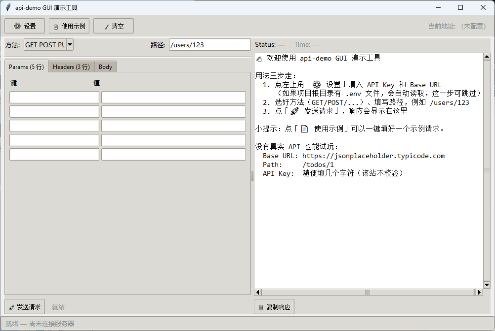

# api-demo

> 对接公司平台 API 的 Python SDK —— 简单、安全、可扩展。

[](https://www.python.org/)
[](https://opensource.org/licenses/MIT)
[](https://github.com/psf/black)

---

## ✨ 特性

- 🚀 **开箱即用**：一行代码初始化，五行代码调用 API
- 🔒 **安全可靠**：自动加载 `.env` 配置，支持自定义超时和重试
- ⚡ **自动重试**：内置智能重试机制（429/5xx 自动退避重试）
- 📦 **连接池**：复用 HTTP 连接，性能更优
- 🎯 **类型友好**：完整类型提示，IDE 智能补全
- 🛡️ **异常清晰**：细粒度异常类型，便于精准处理
- 🐍 **现代 Python**：基于 Python 3.9+ 语法，向后兼容

---

## 📦 安装

### 从 PyPI 安装（推荐，待发布后可用）

```bash
pip install api-demo
```

### 从源码安装（开发版）

```bash
git clone https://github.com/callli666/demo.git
cd demo
pip install -e .
```

---

## 🚀 快速开始

### 1. 创建配置文件

在项目根目录创建 `.env` 文件：

```bash
API_KEY=your_api_key_here
API_BASE_URL=https://api.yourcompany.com
```

> ⚠️ **重要**：`.env` 文件包含敏感信息，**不要提交到 Git**（已通过 `.gitignore` 自动忽略）。

### 2. 编写代码

```python
from api_demo import Client

# 初始化客户端（自动读取 .env）
with Client() as client:
    # 调用任意 RESTful 接口
    user = client.get("/users/123")
    print(user)
```

### 3. 运行

```bash
python your_script.py
```

---

## 📖 详细使用

### 基础用法

```python
from api_demo import Client

client = Client()

# GET 请求
users = client.get("/users", params={"page": 1, "size": 10})

# POST 请求
new_user = client.post("/users", json={"name": "Alice", "email": "alice@example.com"})

# PUT 请求
client.put("/users/123", json={"name": "Bob"})

# DELETE 请求
client.delete("/users/123")

# PATCH 请求
client.patch("/users/123", json={"status": "active"})

client.close()
```

### 推荐：使用上下文管理器

```python
from api_demo import Client

# 自动管理连接
with Client() as client:
    result = client.get("/users/123")
    print(result)
# 离开 with 块后自动关闭
```

### 自定义配置

```python
client = Client(
    api_key="your_key",           # 也可直接传入
    base_url="https://api.example.com",
    timeout=60,                   # 超时时间（秒）
    max_retries=5,                # 最大重试次数
    backoff_factor=1.0,           # 重试退避因子
    verify_ssl=True,              # 是否校验 SSL 证书
)
```

### 错误处理

```python
from api_demo import (
    Client,
    APIError,
    AuthError,
    NotFoundError,
    RateLimitError,
    ServerError,
)

with Client() as client:
    try:
        data = client.get("/users/123")
    except AuthError:
        print("认证失败，请检查 API_KEY")
    except NotFoundError:
        print("资源不存在")
    except RateLimitError:
        print("请求过于频繁，请稍后再试")
    except ServerError as e:
        print(f"服务器错误：{e.status_code}")
    except APIError as e:
        print(f"其它错误：{e}")
```

---

## 🗂️ 项目结构

```
api-demo/
├── api_demo/              # 核心包
│   ├── __init__.py
│   ├── client.py          # 客户端主类
│   ├── exceptions.py      # 异常定义
│   └── gui/               # tkinter 桌面 GUI（演示用）
│       ├── app.py
│       ├── widgets.py
│       ├── settings.py
│       └── constants.py
├── examples/              # 使用示例
│   ├── basic_usage.py
│   └── advanced_usage.py
├── tests/                 # 单元测试
├── docs/                  # 详细文档
├── run_gui.py             # GUI 启动脚本（源码运行）
├── build_gui.bat          # 一键打包 .exe 脚本
├── .env.example           # 环境变量模板
├── .gitignore
├── LICENSE
├── README.md
├── pyproject.toml
├── requirements.txt
└── CHANGELOG.md
```

---

## 🧪 运行示例

```bash
# 基础示例
python examples/basic_usage.py

# 高级示例
python examples/advanced_usage.py
```

---

## 🖥️ GUI 桌面版

除了命令行调用，本项目自带一个**桌面演示工具**，可以鼠标点点点就发请求、看响应。
底层仍使用 `api_demo.Client`，GUI 只是更友好的壳。

### 启动方式

```bash
# 方式 1：直接跑脚本（无需安装）
python run_gui.py

# 方式 2：装包后用命令（推荐）
pip install -e .
intelligent-assistant
```

> 💡 GUI 使用 Python 自带的 **tkinter**，**无需任何额外依赖**。
> 极少数 Linux 发行版需要 `sudo apt install python3-tk`。

### 打包成 .exe（双击启动，无需 Python 环境）

用 PyInstaller 把 GUI 打成单文件 .exe，可以拷给任何 Windows 电脑用：

```bash
# 1. 装 PyInstaller（一次性）
pip install pyinstaller

# 2. 打包
pyinstaller --onefile --windowed --name "intelligent assistant" --icon reddit_socialnetwork_23460.ico run_gui.py
```

或者直接双击项目根目录的 `build_gui.bat`，脚本会自动检测并安装 PyInstaller。

打包完成后：
- 产物：`dist/intelligent assistant.exe`（约 15 MB，单文件、双击即用）
- 可以把它拖到桌面、钉到任务栏、拷给同事

### 界面分区

| 区域 | 作用 |
|------|------|
| 顶部工具条 | ⚙ 设置 / 📄 使用示例 / 🧹 清空 / 当前地址显示 |
| 左侧「请求」 | 选方法（GET/POST/PUT/DELETE/PATCH）、填路径、Params / Headers / Body 三页签 |
| 右侧「响应」 | 状态码 + 耗时 + 格式化后的 JSON 响应 + 错误高亮 |
| 底部状态栏 | 当前状态（就绪 / 请求中 / 错误提示） |

### 无真实 API 也能试玩

填以下内容即可看到真实的 JSON 响应（公开测试站，不校验 Key）：

| 字段 | 值 |
|------|----|
| Base URL | `https://jsonplaceholder.typicode.com` |
| Path | `/todos/1` |
| API Key | 任意字符 |
| Method | GET |



---

## 🔧 配置环境变量

| 变量名 | 必填 | 默认值 | 说明 |
|--------|------|--------|------|
| `API_KEY` | ✅ | - | 平台分配的 API 密钥 |
| `API_BASE_URL` | ✅ | - | API 基础地址，如 `https://api.example.com` |
| `API_TIMEOUT` | ❌ | 30 | 请求超时（秒） |

---

## 🤝 贡献

欢迎贡献代码、报告问题或提出建议！

1. Fork 本仓库
2. 创建特性分支 (`git checkout -b feature/AmazingFeature`)
3. 提交更改 (`git commit -m 'feat: 添加某个很棒的功能'`)
4. 推送到分支 (`git push origin feature/AmazingFeature`)
5. 创建 Pull Request

---

## 📄 开源协议

本项目基于 MIT 协议开源，详见 [LICENSE](LICENSE) 文件。

---

## 📮 联系方式

- 作者：carlli666
- 邮箱：lhe6183@gmail.com
- 问题反馈：[GitHub Issues](https://github.com/callli666/demo/issues)
